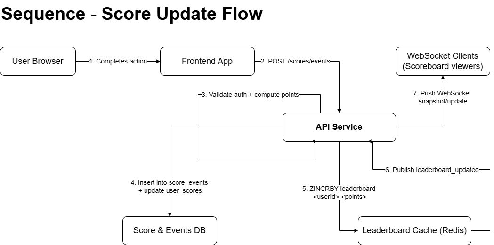
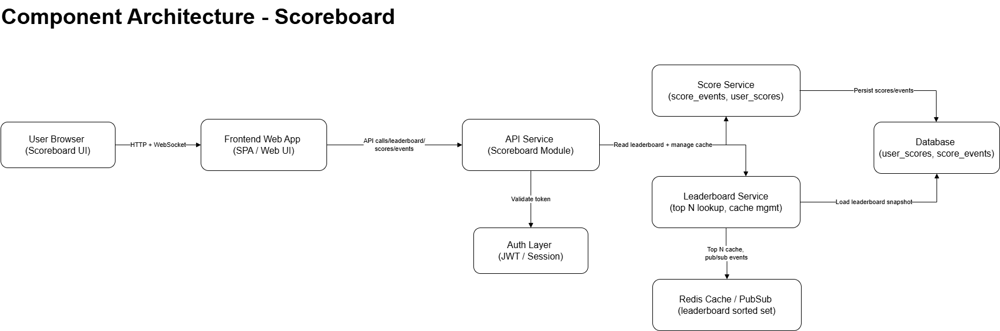
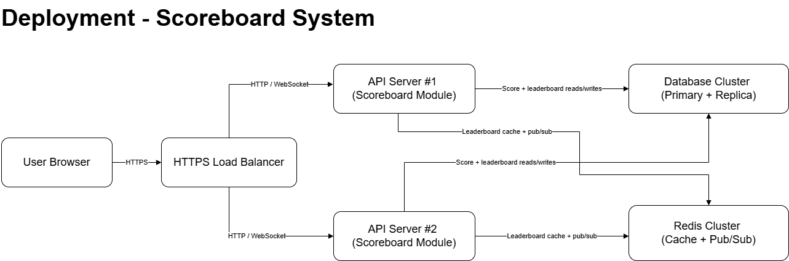
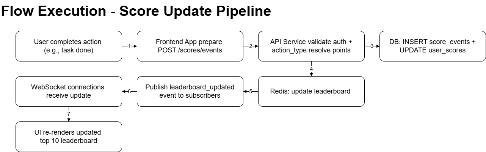

# Scoreboard Module — API Service Specification

## 1. Overview

The Scoreboard Module provides the backend capabilities for maintaining a **real-time leaderboard** on the website. Users accumulate scores by completing certain actions; each action triggers a backend API call to update scores. The system must:

- Track and update per-user scores  
- Maintain a cached *top 10 leaderboard*  
- Push live leaderboard updates to all connected clients  
- Prevent unauthorised score manipulation  

The module is intentionally backend-framework-agnostic and can run on Python (FastAPI, Flask), Go, Node.js, or similar application servers.

---

# 2. Diagrams (Stored in `./diagrams`)

Each diagram is included in two versions:

- **`.drawio`** — editable in Draw.io / diagrams.net  
- **`.png`** — viewable on any device  

> **Note:**  
> If you do not have the Draw.io desktop app installed, you can still open the `.drawio` files using the online editor:  
> https://app.diagrams.net  
>  
> Or use the `.png` images in the same folder.

---

## **2.1 Sequence Diagram — Score Update Flow**

**Files:**
- `./diagrams/sequence_score_update.drawio`  
- `./diagrams/sequence_score_update.png`

**Preview:**



---

## **2.2 Component Architecture Diagram**

**Files:**
- `./diagrams/component_arch_scoreboard.drawio`  
- `./diagrams/component_arch_scoreboard.png`

**Preview:**



---

## **2.3 Deployment Diagram**

**Files:**
- `./diagrams/deployment_scoreboard.drawio`  
- `./diagrams/deployment_scoreboard.png`

**Preview:**



---

## **2.4 Execution Flow Diagram**

**Files:**
- `./diagrams/execution_flow.drawio`  
- `./diagrams/execution_flow.png`

**Preview:**



---

## 3. Goals & Non-Goals

### Goals
1. Persist user score changes in an append-only `score_events` log.  
2. Maintain a fast, accurate leaderboard using Redis sorted sets.  
3. Provide API endpoints for:
   - recording score events  
   - fetching the leaderboard  
4. Provide WebSocket connections for **real-time updates**.  
5. Validate and secure all score updates to prevent tampering.  

### Non-Goals
- Determining the origin of user actions  
- Implementing global authentication  
- Advanced anti-cheat mechanisms  

---

## 4. High-Level Architecture

The system consists of the following components:

- User Browser  
- Frontend Web App  
- API Service  
- Database  
- Redis Cache / PubSub  
- WebSocket Clients  

---

## 5. Data Model

### `user_scores`

| Field | Type | Description |
|-------|------|-------------|
| user_id | PK | Unique user identifier |
| score | INT | Current total score |
| updated_at | timestamp | Last update |

### `score_events`

| Field | Type | Description |
|-------|------|-------------|
| id | PK | Unique event ID |
| user_id | FK | User performing the action |
| action_type | string | Action completed |
| points | INT | Points awarded |
| created_at | timestamp | When the event was created |
| idempotency_key | string | Prevents duplicate submissions |

---


# API Endpoints Specification

## 6. API Endpoints

### 6.1 Common Conventions

- Base path: `/api/v1`
- All requests and responses use `Content-Type: application/json`.
- Authentication uses:

```
Authorization: Bearer <jwt-token>
```

Generic error shape:

```json
{
  "error": {
    "code": "string",
    "message": "Human readable description"
  }
}
```

---

### 6.2 POST `/scores/events`

Records a new scoring action for the authenticated user.

#### Request

**Method:** POST  
**Path:** `/api/v1/scores/events`  
**Headers:**

```
Authorization: Bearer <jwt-token>
Content-Type: application/json
Idempotency-Key: <uuid-optional>
```

**Body:**

```json
{
  "action_type": "TASK_COMPLETED"
}
```

#### Successful Response (201 Created)

```json
{
  "user_id": "12345",
  "action_type": "TASK_COMPLETED",
  "awarded_points": 10,
  "new_score": 150,
  "processed_at": "2025-11-13T05:21:34Z"
}
```

#### Idempotent Replay (200 OK)

```json
{
  "user_id": "12345",
  "action_type": "TASK_COMPLETED",
  "awarded_points": 10,
  "new_score": 150,
  "processed_at": "2025-11-13T05:21:34Z",
  "idempotent": true
}
```

#### Errors

**400 Bad Request**

```json
{
  "error": {
    "code": "INVALID_ACTION_TYPE",
    "message": "action_type 'FOO_BAR' is not supported."
  }
}
```

**401 Unauthorized**

```json
{
  "error": {
    "code": "UNAUTHENTICATED",
    "message": "Invalid or missing authentication token."
  }
}
```

**409 Conflict**

```json
{
  "error": {
    "code": "IDEMPOTENCY_CONFLICT",
    "message": "Idempotency key already used for a different request."
  }
}
```

---

### 6.3 GET `/leaderboard`

Fetches the global leaderboard.

#### Query Parameters

| Param | Type | Default | Description |
|-------|-------|----------|-------------|
| `limit` | integer | 10 | How many records to return |
| `offset` | integer | 0 | Pagination offset |
| `scope` | string | global | Optional leaderboard scope |

**Example:**  
`GET /api/v1/leaderboard?limit=10&offset=0`

#### Response (200 OK)

```json
{
  "limit": 10,
  "offset": 0,
  "items": [
    {
      "rank": 1,
      "user_id": "42",
      "display_name": "alice",
      "score": 320
    }
  ],
  "generated_at": "2025-11-13T05:30:00Z"
}
```

---

### 6.4 GET `/leaderboard/me`

Returns the requester’s score and ranking.

#### Response (200 OK)

If user has scored:

```json
{
  "user_id": "12345",
  "display_name": "charlie",
  "score": 120,
  "rank": 57,
  "around_me": [
    { "rank": 56, "user_id": "111", "score": 121 },
    { "rank": 57, "user_id": "12345", "score": 120 },
    { "rank": 58, "user_id": "222", "score": 118 }
  ]
}
```

If user has never scored:

```json
{
  "user_id": "12345",
  "display_name": "charlie",
  "score": 0,
  "rank": null,
  "around_me": []
}
```

---

### 6.5 WebSocket `/ws/leaderboard`

Provides a live leaderboard update stream.

#### Initial Snapshot Message

```json
{
  "type": "snapshot",
  "limit": 10,
  "items": [
    {
      "rank": 1,
      "user_id": "42",
      "display_name": "alice",
      "score": 330
    }
  ],
  "generated_at": "2025-11-13T05:31:10Z"
}
```

#### Incremental Update Message

```json
{
  "type": "update",
  "items": [
    {
      "rank": 1,
      "user_id": "42",
      "display_name": "alice",
      "score": 340
    }
  ],
  "generated_at": "2025-11-13T05:31:20Z"
}
```

#### Ping / Keepalive

```json
{
  "type": "ping",
  "timestamp": "2025-11-13T05:32:00Z"
}
```

#### WebSocket Error Message

```json
{
  "type": "error",
  "error": {
    "code": "UNAUTHENTICATED",
    "message": "Authentication token expired."
  }
}
```


## 7. Execution Flow Summary

1. User completes action  
2. Frontend sends POST `/scores/events`  
3. API validates + calculates points  
4. DB updated  
5. Redis updated  
6. Redis publishes  
7. API pushes WebSocket update  

---

## 8. Security

- Server-side score authority  
- JWT authentication  
- Idempotency  
- Rate limiting  
- Auditable score_events log  

---

## 9. Performance Considerations

- Redis sorted set operations  
- Horizontal API scaling  
- Periodic DB reconciliation  

---

## 10. Error Handling

| Condition | Status | Meaning |
|----------|--------|---------|
| Invalid JWT | 401 | Unauthorized |
| Bad input | 400 | Invalid payload |
| Duplicate idempotency_key | 409 | Already processed |
| DB unavailable | 503 | Retry later |
| Rate limit exceeded | 429 | Too many requests |

---

## 11. Observability

- Logging  
- Metrics  
- Tracing  
- Alerts  

---

## 12. Future Improvements

- Per-user rank API  
- Multi-leaderboards  
- Time-based leaderboards  
- Pagination  
- Admin dashboard  
- Suspicious activity detection  

